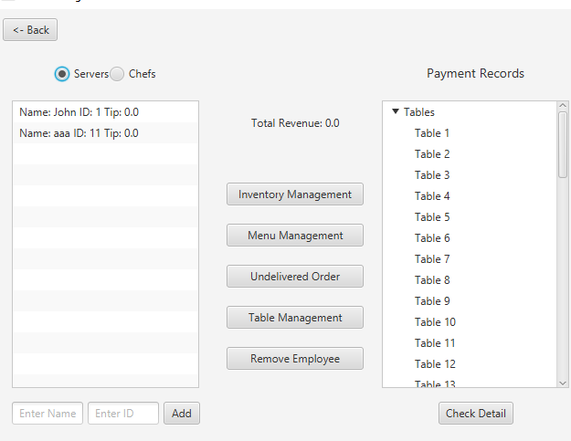

## Introduction

A restaurant management tool as the project for CSC207 (2018) completed in group of 4 (group#0242).
This is an archive of the files for Phase2 which is the final phase where the code is connected to a functional GUI in which all the interactions take place. 

### Learning Objectives (cited from the project handout)
- Do a CRC design
- Use Git in a group setting
- Build a graphical user interface using JavaFX (Phase 2)
- Write a "real" application
- Design and work with configuration files
- Implement a logging system
- Work with all Java features seen so far
- Work in an environment where not everything is specified

## Features

We wrote it with real world application in mind so we made sure it is easily scalable and covers typical features a real life restaurant app would have, such as orders, splitable bills, tipping, add/remove ingredient from a dish, revenue and order status monitoring, accept/reject order, employee management, staff login, table assignments, inventory management, etc. There is also a event logger that keeps a record of all the events for reference purposes.

When launching, the state of the restaurant is retrived from the configuration files which gets updated upon closing.

## Format for configuration files:

inventory.txt: this file creates and records the state of the inventory of the
restaurant.\
Format:\
name | quantity | low limit | price\
Example:\
tomato | 40 | 10 | 0.5

menu.txt: this file creates and records the menu of the restaurant.\
Format:\
name | price | ingredient 1:quantity ; ingredient 2:quantity ; ... ; ingredient n:quantity\
Example:\
Hamburger | 8.88 | flour:1 ; pork:1 ; lettuce:1 ; tomato:1

restaurant.txt: this file creates and records the staffs and tables of the restaurant.\
Format:\
For tables:\
TableForX | total number of table of size X.\
Example:\
TableFor2 | 24\
For staffs:\
position | name | id\
Example:\
Manager | Tom | 1\
Note that There can be only one manager in the configuration file.

## UML Diagram

## Instruction

### 1. Login:
Use the correct name and id of an employee to log in.\
If no configuration file exist, login using name: "admin" and id: "1" as a Manager to add necessary component to the restaurant. 

### 2. Manager
Manager can add/remove an employee, make modifications to the menu and table configuration, add items to inventory, and monitor the overall status such as table status, undelivered order, total revenue, and employee status and tips received. When a item is running low in inventory, manager can also generate a restock request in written format.\

### 3. Order:
Login as a Server\
Add customer to a empty table or proceed to an occupied table to begin order.\
Must place order for each customer separately.\
Can add requirements such as add/remove ingredients to a dish after it is added to "Course Ordered" list.\
Must press "Finish Order" after ordering before exiting otherwise the order won't be placed.

### 4. Cook:
Login as a Chef\
Press "Start Dish" button under "Wait List" to start cooking the first order on the wait list.\
Press "Start Dish" button under "Returned List" to start remaking the first order on the returned list.\
Press "Complete Dish" button to finish cooking and inform all servers to deliver the finished course.

### 5. Deliver :
Login as Server\
If there is course waiting to be delivered, the only action the server can do is to deliver it.\
In the pop up window, if course is accepted, press Yes.\
If course is rejected, press No and write the reason in the text field.

### 6. Billing and payment:
Login as a Server\
When all courses for a table are either "delivered and accepted" or "cancelled"the server can get bill for this table.\
After successful payments, i.e. payment amount higher than bill amount.\
Server can click finish button to clear the table.

### 7. Receive ingredient :
All employees are capable of receiving ingredients.\
Chef cannot receive ingredients when cooking.

## events.txt file (no longer needed)
Format for events file:(Phase 1 only. Already deleted in phase 2)

events.txt: this file records all the events that will be processed by the project.

Each line must starts with a case matches the cases listed in LineProcessor.java file.

NOTE: NO line in event.txt should have any space in it unless specified.

For startOrder, it must be in this format:
startOrder/table id(should be an integer)

For order, it must be in this format:
order/table id/course name/ingredient1 name:ingredient1 number(if you want to remove, use a negative int)/ingredient2
name:ingredient2 number(You can add as many ingredients as you want, each one should be separated by a '/'.)

For endOrder, it must be in this format:
endOrder/table id(should be an integer)

For deliver, it must be in this format:
deliver/whether you accept or reject this course(use yes or no)/reason(If you accept, then you must not have this part.
 If you reject, you do not have to add this part but you can.)

For startCooking, it must be in this format:
startCooking/chef id(should be an integer)

For finishCooking, it must be in this format:
finishCooking/chef id(should be an integer)

For receive, it must be in this format:
receive/ingredient name:ingredient amount(you can only receive on ingredient in one line)

For finish, it must be in this format:
finish/table id(should be an integer)

For fire, it must be in this format:
fire/occupation(Can only be Chef or Server)/person id

For hire, it must be in this format:
hire/occupation(Can only be Chef or Server)/person name/person id

For addCourse, it must be in this format:
addCourse/name | price | ingredient 1:quantity ; ingredient 2:quantity ; ... ; ingredient n:quantity(part after '/'
must be exactly the same as the line for menu.txt)

For checkInventory, it must be in this format:
checkInventory

For generateRequest, it must be in this format:
generateRequest/amount of ingredient(If you don't enter it, it will be set by default value)

For enter, it must be in this format:
enter/amount of person/table id

For removeCourse, it must be in this format:
removeCourse/course name

For getOrderStatus, it must be in this format:
getOrderStatus/table id

For setPrice, it must be in this format:
setPrice/ingredient name/price of ingredient

For setLow, it must be in this format:
setLow/ingredient name/amount of low limit

Further requirement for event.txt:
If you do things listed below, the function won't throw exception, but it doesn't make sense logically to begin with.

* Using id/name that doesn't exist/hasn't been assigned.
* Assign the same id of Chef/Server to different Chefs/Servers.
* Add a course that already exists/has the same name as an existing course to the menu.
* startOrder for a table that no one is on.
* Order/endOrder for a table hasn't startOrder.
* finishCooking for chef hasn't startCooking.
* End the events before all the tables finish.

Note: bill for a table only includes the courses delivered to the table and accepted. Rejected courses or those are
not yet delivered/cooked are not included.

